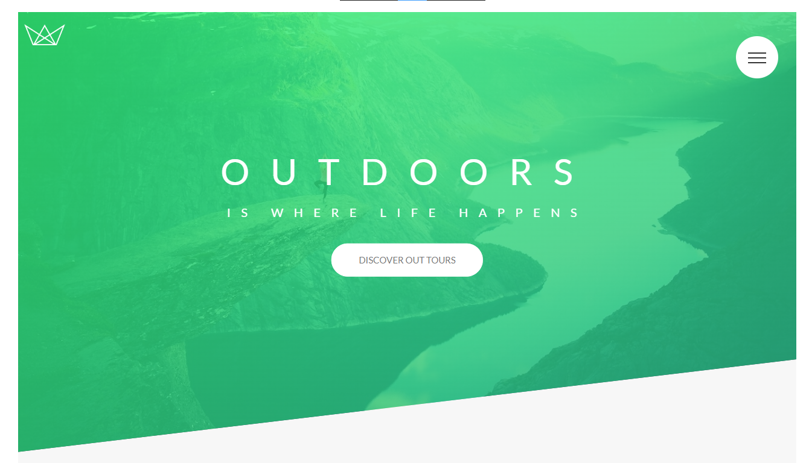

# Udemy Advanced CSS SASS Course

## Welcome! 👋

Thanks for checking out this coding practice.

[Udemy course](https://www.udemy.com/course/advanced-css-and-sass/) One of the best courses to learn CSS!

**To do this project , you need a good understanding of HTML, CSS**

# The Natours Project
A tourist company site with four main sections, About, Features, Tours, Stories, along with header and footer. It is a landing page, but a lot of visual and also functionality is implemented and performed using only pure CSS.

# TOPICS COVERED: 

- Arrays and more than 20 methods including {

    Modern CSS properties and techniques such as:
    clips, transforms, animations, background video, ... .

    The page is float layout based, however, in some sub sections grid and flex are used too.

    a list of through list of all properties and techniques is as follows:

    - Building a simple grid sytem
    - Using attribute selector
    - Using calc() fuction
    - Using BEM system to name HTML elements and classes
    - How to use utility classes
    - Tranfrom multiple properties simultaneously
    - Using outline-offset() and outline
    - Pseudo-calss :not()
    - Importing an icon font
    - Skew, and another ways to reach same purpose
    - How and when to use "Direct child: selector
    - Building rotating cards
    - Using perspective in CSS
    - Using backface-visibility
    - Using backgrounf blend modes
    - Introducing box-decoration-break
    - Using clone content
    - Shaping text around objects using shape-outside and float
    - Image filters
    - Creating background video for a section
    - <video> HTML element
    - Using object-fit property
    - Solid color gradients
    - Working with 'general' and 'adjacent' "sibiling selectors"
    - Pseudo-elements and states :
        - ::input-placeholder
        - :checked 
        - :placeholder-shown
        - :focus
        - :invalid
        - :chekced
        - :traget

    - Building custom radio buttons
    - "Checkbox hack"
    - Cubic bezier curves custom animation
    - Animate solid-color gradients
    - transform-origin
    - Display values > table and tabel-cell 
    - Text columns
    - Automatically hyphenate words using hyphen property
    - Pop-up window using only CSS
    - Responsive design 
    - srcset attribute and source element for images
    - <picture> element
    - Media queries @media, also @supports 
    - Compling SASS to CSS using npm packages(CANNOT bed seen on this repo)

}

# Website is exactly as designed by the author, but the code and functions are all rewrited and implemented by me. Special thanks to the master Jonas for these hands-on and informative projects.

**Have fun building!** 👩‍💻👩‍💻👩‍💻👩‍💻👩‍💻👩‍💻 
